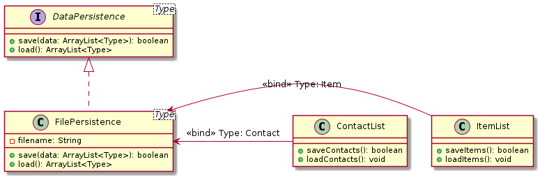
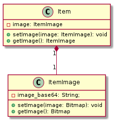

# Code smell 1: Duplicated code
Affected classes / methods:

- **ContactList**.saveContacts() / loadContacts()
- **ItemList**.saveItems() / loadItems()

The code in these methods is duplicated and can be refactored into a separate class. This class could be called for example DataPersistence and would provide the save/load methods to be used by both the ContactList and the ItemList.  
Also, this improves the separation of responsibilities and algorithms for saving/loading can be changed easily.
## Rough diagram of the change

# Code smell 2: Large Class
In: 

- **Item**.addImage() / getImage()

The Item class represents an item with an image. It saves the image as a base64 string.

It is however **not** the Items responsibility to know how to convert a Bitmap to base64 or vice versa. This responsibility should be separated to avoid a large class. Changing the way the image is serialized and deserialized is easier with this change.

## Rough diagram of the change

